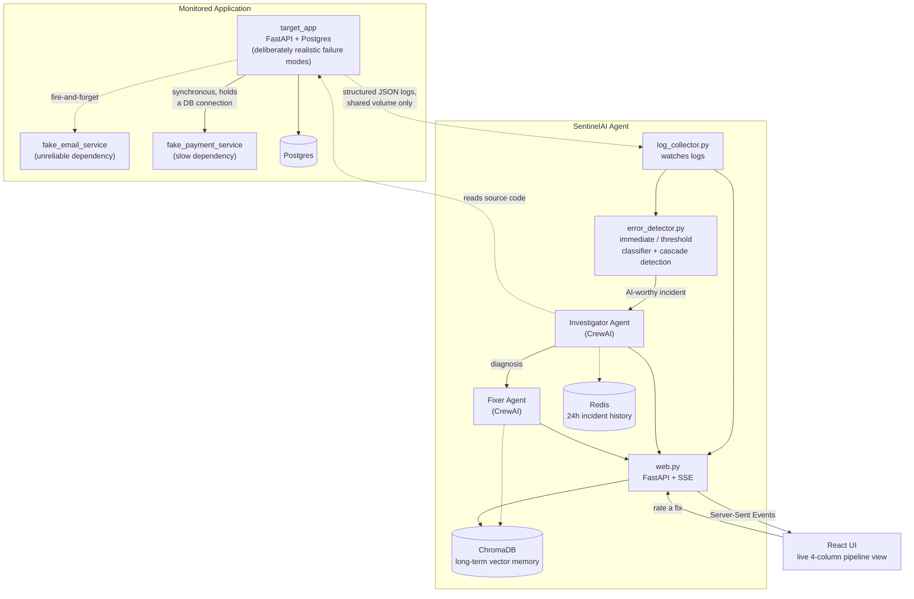

# SentinelAI

**An AI agent that watches a live, running application and debugs it the way a senior engineer would.** Not just catching errors, but reasoning about why they happened, reading the actual source code to find root cause, and proposing a reviewable fix. Never auto-applies anything.

## What it actually does

1. **Watches** a target application's structured logs in real time, completely decoupled from it (no shared code, no Docker socket access; only a log file and a thin HTTP layer).
2. **Detects** incidents using a two-tier classifier: deterministic failures (`user_not_found`) escalate immediately; probabilistic ones (`db_pool_exhausted`) need a confirmed pattern within a sliding window before they count, with a dispatch cooldown so a single burst can't trigger dozens of redundant AI calls.
3. **Investigates**, for the subset of incidents where the log line alone doesn't already explain the cause: a CrewAI agent reads the real source code (no pre-written hints) and states a root cause with a confidence score.
4. **Proposes a fix** via a second, separate agent that drafts a code diff and plain-English explanation for human review, optionally checking long-term semantic memory (local embeddings, ChromaDB) for similar past fixes first. The diagnose/propose-fix split isn't just organizational; it's the actual safety boundary. The system is architecturally incapable of applying its own fixes, not just instructed not to.
5. **Shows all of it live** in a 4-column web UI (target app activity, detection, investigation, fix proposal) with full incident correlation, so a tool call, a diagnosis, and a fix all visibly trace back to the same trigger. Every fix can be rated correct/partial/incorrect, which is real outcome-tracking data for future model calibration, not just a UI nicety.

## Architecture



## Why these specific design choices

- **Decoupled by construction, not convention.** The agent and the target app never start each other and share nothing but a log file. Chosen deliberately over Docker SDK log streaming, since socket access would mean the monitoring agent could see into the monitored app's internals, the opposite of what real observability tooling does.
- **Two AI agents, not one, because of the safety boundary, not because one agent couldn't technically do both.** Diagnose and propose-fix are split so "never auto-applies" is a structural fact about the system, not just a prompt instruction inside a single combined agent.
- **The investigator is never told the answer.** Context hints teach methodology ("you're calling a dependency you don't control, check our own retry logic"), never the specific bug. Verified directly by removing a hint and confirming the agent still found the real root cause unaided.
- **Every "this would obviously work" assumption gets tested before being trusted.** A multi-service cascade was hypothesized, found not to work the assumed way (async I/O waits don't tie up Python's event loop), and rebuilt around the actual scarce resource (a connection pool) once that was understood. Documented in detail rather than quietly fixed.
- **Cost control is engineered, not assumed.** A real bug (a sentinel value collision) was caught by a synthetic unit test before it ever reached production, and a dispatch cooldown prevents a single incident burst from generating dozens of redundant LLM calls.

## Tech stack

| Layer | Choice |
|---|---|
| Target app | FastAPI, Postgres (raw `asyncpg`, no ORM, deliberate, for connection-pool transparency) |
| Detection | Pure Python, stateful sliding-window classifier |
| AI reasoning | CrewAI, OpenAI (`gpt-4o-mini`) |
| Long-term memory | ChromaDB, local `sentence-transformers` embeddings (zero marginal API cost) |
| Short-term history | Redis |
| Live UI backend | FastAPI, Server-Sent Events |
| Live UI frontend | React (Vite), `react-markdown` + `react-syntax-highlighter` |
| Orchestration | Docker Compose, one command (`docker compose up`) starts everything including the UI |

## Running it

```bash
cp .env.example .env   # fill in OPENAI_API_KEY and Postgres credentials
docker compose up --build
```

- Target app: `http://localhost:8000`
- Live UI: `http://localhost:5173`
- Agent API: `http://localhost:9000`

To run without spending on AI calls (detection still works fully): `OPENAI_API_KEY= docker compose up`.

## Documentation

- [`docs/FIRST_ITERATION_ARCHITECTURE.md`](docs/FIRST_ITERATION_ARCHITECTURE.md): Week 1, frozen historical record.
- [`docs/SECOND_ITERATION_ARCHITECTURE.md`](docs/SECOND_ITERATION_ARCHITECTURE.md): the full build log, every feature, every design decision, every bug found and how it was actually diagnosed.
- [`docs/ERROR_REFERENCE.md`](docs/ERROR_REFERENCE.md): how to trigger each failure mode and what to expect.
